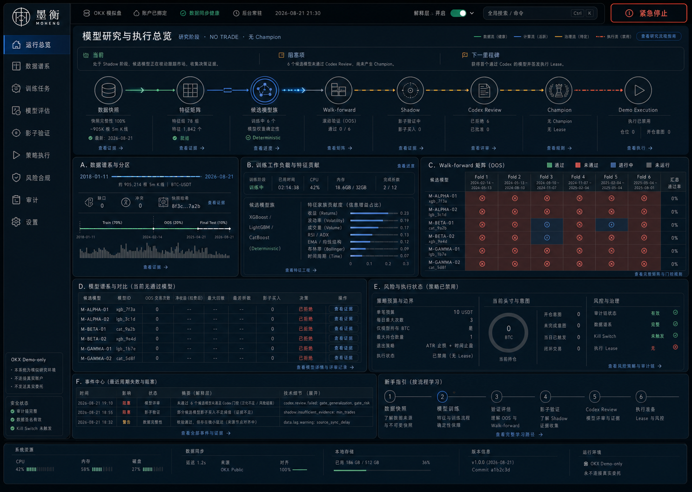

# 墨衡 MOHENG

[](https://github.com/mikutea/tideguard-okx-demo/actions/workflows/ci.yml)

墨衡是一套 Windows 本地运行的 OKX 现货量化研究、模型治理与受控执行系统。它把公共行情、训练、样本外验证、未来 Shadow、Codex 监督、确定性风控和交易执行拆成不同权限平面，并在专业可视化驾驶舱中展示每一步证据。

v0.4 默认使用 **OKX 模拟盘**。它同时提供隔离的 OKX Live 连接和人工限时交易路径，但 Live 的 AI 自动入场保持禁用，直到 Demo 积累足够的前瞻成交证据并另行实现实盘专属预算与授权。软件不承诺收益，也不会把 accuracy 或回测排行描述为盈利保证。



## 核心能力

- OKX 官方公共 `BTC-USDT / SPOT / 5m` 历史可恢复回填；当前接口实测可追溯到 2018-01-11，具体起点每次仍以官方空页为准。
- 独立 `market-data.sqlite3`：确认线、严格时间网格、内容冲突隔离、缺口门、流式快照 SHA-256 和断点续传。
- NumPy 向量化的冻结线性逻辑候选；三组预声明配置共享同一特征矩阵和相同 OOS cohort。
- v4 rolling walk-forward：365 天训练、13 bars purge/embargo、90 天非重叠 OOS、long/flat、非重叠资本、止损/止盈和 24 bps 压力成本。
- challenger 优先与同 cohort champion 比较；跨 cohort 时使用新快照内同 `trainingConfigSha256` 的 champion 配方基线，缺失即失败关闭。
- 新候选必须经过确定性门、未来 Shadow、Codex 脱敏证据审查和 generation CAS；训练失败不会替换当前 champion。
- Demo 自动订单使用限价 IOC，按真实累计成交和费用记录模型自有库存；未知提交绝不盲重试。
- 常驻后台负责训练调度、持仓恢复、CAA 失联保护、退出管理和审计；关闭 UI 不代表停止后台。
- “墨衡”专业驾驶舱包含运行中心、数据谱系、训练阶段、walk-forward 矩阵、模型谱系、执行与风险、问题中心及 Demo/Live 设置。

## Demo 与 Live

| 能力 | Demo（默认） | Live |
|---|---|---|
| 独立凭证 | `Tideguard.OKX.Demo` | `Tideguard.OKX.Live` |
| 请求环境 | 强制模拟头 | 明确无模拟头 |
| 状态与订单 tag | 旧目录兼容 / `tideguarddemo` | `live/` / `tideguardlive` |
| 人工交易 | 10 分钟授权 | 60 秒独立高风险授权 |
| 单笔硬上限 | 25 USDT | 10 USDT 且不超过权益 0.05% |
| AI 长期自动执行 | champion + Codex lease + Demo master | v0.4 禁用 |

Live 切换不是普通开关。服务端会关闭自动化、核对两侧审计/订单/模型持仓、验证目标 OKX `account/config`、要求 Read+Trade/禁 Withdraw/IP 绑定/Spot mode，然后签发绑定证据的一次性 challenge。用户需完成风险勾选、逐字确认和 10 秒冷静期；确认时全部条件会再次核对。切换只对下一次重启生效，重启后仍为观察+急停。

详见 [Demo / Live 安全边界](docs/LIVE-SAFETY.md)。

## Windows 桌面版

从 [GitHub Releases](https://github.com/mikutea/tideguard-okx-demo/releases/latest) 下载 `Moheng-Setup-*.exe`。安装器使用原 Tideguard AppId、数据目录、mutex 和内部 EXE 名称保持升级兼容；用户可见名称、图标、快捷方式和 Release 产物已切换为墨衡。

开始菜单包含：

- **墨衡 MOHENG**：打开运行驾驶舱；
- **墨衡凭证管理**：在隔离窗口管理 Demo / Live Windows Credential Manager 凭证；
- **启动墨衡后台服务**：启动本机长期研究、回填与训练 daemon；安装时也可选择登录自启动；
- **停止墨衡后台服务**：安全停止当前用户 daemon。

安装器和 ZIP 不包含 API 凭证、本地 SQLite、行情缓存或模型运行状态。应用尚未代码签名，Windows SmartScreen 可能显示未知发布者；请从本仓库 Release 下载并核对 `SHA256SUMS.txt`。

## 从源码运行

前置条件：Windows、Python 3.11+、Node.js 22、Corepack。

```powershell
Set-ExecutionPolicy -Scope Process Bypass
.\scripts\setup.ps1
.\.venv\Scripts\python.exe -m okx_demo_lab.cli credentials set --environment demo
.\scripts\run.ps1
```

可选的 Live 凭证必须单独设置：

```powershell
.\.venv\Scripts\python.exe -m okx_demo_lab.cli credentials set --environment live
```

不要把 Key、Secret 或 Passphrase 粘贴到聊天、截图、`.env`、项目文件或日志。建议 Live 使用独立子账户、小额可全部损失资金、Read+Trade、禁 Withdraw 和固定 IP 白名单。OKX 的 Trade 权限仍可能包含转账/配置类写操作。

源码运行状态写入已忽略的 `.local-data\`；安装版使用 `%LOCALAPPDATA%\Tideguard\`。外显品牌已更换，但内部命名空间故意保留，避免升级丢失既有 Demo 账户绑定和审计链。

## 模型更迭链

```text
OKX public completed candles
  -> recoverable history store + immutable snapshot
  -> deterministic features + cost-aware labels
  -> three frozen challengers on one cohort
  -> rolling purged walk-forward OOS
  -> prospective shadow
  -> Codex content-addressed review
  -> champion generation / rollback
  -> deterministic preview + dispatch guard
  -> OKX Demo IOC entry / model-owned exit
```

“自我更新”指产生新的不可执行模型 artifact，再由固定门槛和 Codex 监督决定晋级；模型不能在线改源码、特征、标签、环境、品种、资金上限、风险策略或 kill switch。不得下载并反序列化来源不明的 `.pkl/.joblib/.pt` “高收益模型”。

Codex Supervisor 只读取脱敏的模型/数据/策略哈希和验证指标：

```powershell
.\.venv\Scripts\python.exe -m okx_demo_lab.cli supervisor review
```

完整说明见 [模型架构](docs/ML-ARCHITECTURE.md)、[长期自动量化架构](docs/AUTONOMY-ARCHITECTURE.md) 和 [历史数据仓库](docs/HISTORY-DATA.md)。历史高速回放可用 `scripts/run-historical-replay.ps1` 在冻结多资产 cohort 上按 30 天周期重训并回放。V4 已将标签对齐到下一根开盘成交与 12 根后退出；最新历史开发结果和集中度限制见 [V4 执行对齐历史收益诊断](docs/reports/v4-profitability/report.html)。它固定为研究证据，不能累计 Shadow 天数或触发订单。

## 第三方模型研究层

GitHub 上的模型、框架和“高收益策略”不会直接进入执行器。隔离的 Python
3.11 研究层会在同一不可变全历史快照上本地重训 scikit-learn、LightGBM、
XGBoost、CatBoost 和 MLP，并统一执行 30 折 rolling OOS、最后四折封存以及
双成本压力测试：

```powershell
.\scripts\setup-research.ps1
.\scripts\run-research-benchmark.ps1
```

2026-08-21 的首轮六模型加集成评测全部被拒绝，没有模型进入 registry、
shadow 或订单链。精确协议、指标与 canonical 报告哈希见
[第三方模型基准](docs/THIRD-PARTY-BENCHMARK.md)，源码与许可边界见
[研究准入清单](research/THIRD-PARTY.md)。

多资产和新闻/社媒扩展遵循独立研究边界：公共 universe 发现不会扩大订单
白名单；弱信号必须保留首次可见时间和许可快照，先做消融与前瞻 Shadow。
设计、当前 6 个临时研究候选和来源拒绝清单见
[多资产与替代数据边界](docs/MULTI-ASSET-ALTERNATIVE-DATA.md)。

## 验证与发行

```powershell
.\scripts\check.ps1
.\packaging\build-release.ps1 -Version 0.4.0
```

离线检查隔离真实 Credential Manager 与环境 selector，执行后端、前端、桌面和打包契约测试以及秘密扫描；不会访问真实私有 API 或发送订单。发行构建使用 Windows x64 Python 3.11、PyInstaller `onedir` 与 Inno Setup。

## 目录

```text
assets/     墨衡 PNG / ICO 品牌资产
backend/    FastAPI、OKX profile、数据仓库、ML、监督、风控与 SQLite 状态
frontend/   React + Vite 专业可视化驾驶舱
desktop/    pywebview 桌面宿主、daemon 与隔离凭证窗口
packaging/  PyInstaller、Inno Setup、锁文件和 GitHub Release 构建
research/   隔离的第三方模型、锁定依赖、报告与许可准入
scripts/    Windows 安装、启动与离线检查
docs/       数据、模型、Live 安全、设计和验证记录
```

公开仓库：<https://github.com/mikutea/tideguard-okx-demo>

## 许可证

项目源码按 [MIT License](LICENSE) 发布；主要运行时组件与许可见 [THIRD-PARTY-NOTICES.md](THIRD-PARTY-NOTICES.md)。第三方依赖及其品牌分别遵循各自许可证；OKX 与墨衡不存在隶属或收益背书关系。
